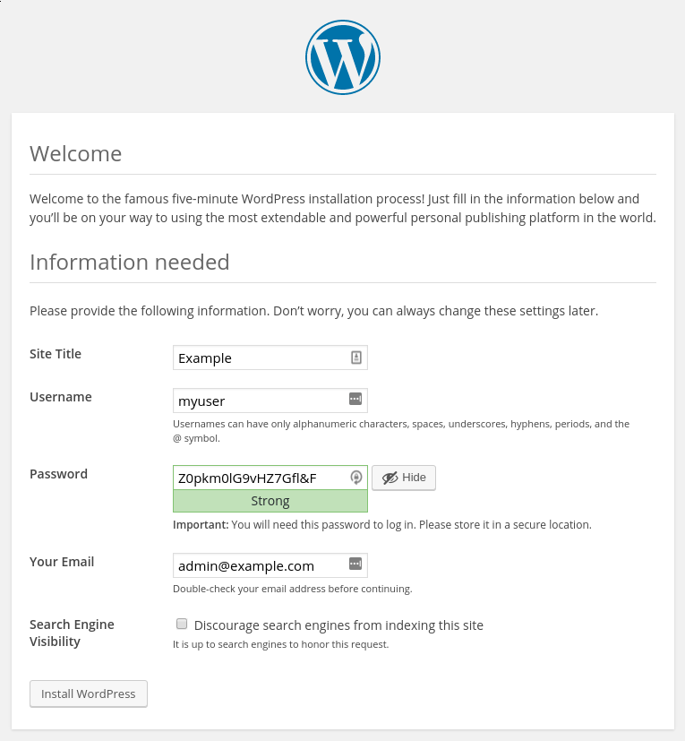
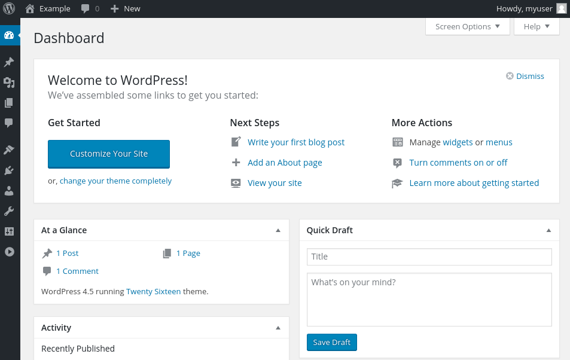

# Instalação do WordPress no Ubuntu Server

### Pré-requisitos:

- Criar ou ter um usuário sudo;

- Instalar o Apache, MySQL e PHP (LAMP);

  

### 1° Passo - Criar um banco de dados MySQL para o WordPress

É necessário fazer login com root no MySQL com o comando: `mysql -u root -p`. Será solicitada a senha cadastrada por você na hora da instalação do MySQL.

Para criar o banco, digite: `CREATE DATABASE wordpressbd DEFAULT CHARACTER SET uft8 COLLATE utf8_unicode_ci;`. 

Depois de criar o banco, crie também um usuário para administrar esse banco. Para criar: `GRANT ALL ON wordpressbd.* TO 'usuariowordpress'@'localhost' IDENTIFIED BY 'senha';`.

Pronto, você já tem um banco e um usuário para administrar o WordPress, para finalizar e atualizar os privilégios do MySQL, digite: `FLUSH PRIVILEGES;` e depois saia do MySQL: `EXIT`. 


### 2° Passo - Instalar algumas extensões do PHP

Primeiramente, atualize a lista de repositórios com o comando: `sudo apt update`.

Depois use este comando para instalar as extensões: `sudo apt install php-curl php-gd php-mbstring php-xml php-xmlrpc php-soap php-intl php-zip`. 

Agora, reinicie o serviço do Apache, digite: `sudo systemctl restart apache2`


### 3° Passo - Ajustar configurações do Apache

Abra o arquivo de configuração do Apache: `sudo nano /etc/apache/sites-available/wordpress.conf`.

Para permitir os arquivos .htaccess, é necessário configurar a diretiva AllowOverride dentro de um bloco Directory:

`<Directory /var/www/wordpress/>
    AllowOverride All
</Directory>`

Precisamos também habilitar o mod_rewrite para usar recurso de link permanente do WordPress: `sudo a2enmod rewrite`.

Para verificar as alterações, digite: `sudo apache2ctl configtest`.

O resultado poderá ser exibido assim: 

> ```
> AH00558: apache2: Could not reliably determine the server's fully qualified domain name, using 127.0.1.1. Set the 'ServerName' directive globally to suppress this message
> Syntax OK
> ```

E para implementar as alterações, reinicie o Apache: `sudo sustemctl restart apache2`.


### 4° Passo - Fazer download do WordPress

Para fazer o download basta digitar esse comando: `curl -O https://wordpress.org/latest.tar.gz`.

Extraia o arquivo: `tar xzvf latest.tar.gz`.

Crie um arquivo .htaccess dentro da pasta do wordpress: `touch /home/usuario/wordpress/.htaccess`.

Altere o arquivo de configuração para o nome de: `cp /home/usuario/wordpress/wp-config-sample.php /home/usuario/wordpress/wp-config.php`.

Crie uma pasta chamada upgrade: `mkdir /home/usuario/wordpress/wp-content/upgrade`.

Agora copie todo o conteúdo da pasta wordpress: `sudo cp -a /home/usuario/wordpress/. /var/www/wordpress`.


### 5° Passo - Configurando diretório WordPress

Atualize as propriedades dos arquivos: `sudo chown -R www-data:www-data /var/www/wordpress`.

Defina as permissões corretas para os diretórios: `sudo find /var/www/wordpress/ -type d exec chmod 750 {} \;` e `sudo find /var/www/wordpress/ -type f exec chmod 640 {} \;`.

É preciso das chaves do WordPress para dar segurança a nossa instalação, para isso, digite o comando: `curl -s https://api.wordpress.org/secret-key/1.1/salt/ >> /var/www/wordpress/wp-config.php`.

> Saída:
>
> ```
> Outputdefine('AUTH_KEY','1jl/vqfs<XhdXoAPz9 NÃO COPIE ESSES VALORES c_j{iwqD^<+c9.k<J@4H');
> define('SECURE_AUTH_KEY','E2N-h2]Dcvp+aS/p7X NÃO COPIE ESSES VALORES {Ka(f;rv?Pxf})CgLi-3');
> define('LOGGED_IN_KEY','W(50,{W^,OPB%PB<JF NÃO COPIE ESSES VALORES 2;y&,2m%3]R6DUth[;88');
> define('NONCE_KEY','ll,4UC)7ua+8<!4VM+ NÃO COPIE ESSES VALORES #`DXF+[$atzM7 o^-C7g');
> define('AUTH_SALT','koMrurzOA+|L_lG}kf NÃO COPIE ESSES VALORES 07VC*Lj*lD&?3w!BT#-');
> define('SECURE_AUTH_SALT','p32*p,]z%LZ+pAu:VY NÃO COPIE ESSES VALORES C-?y+K0DK_+F|0h{!_xY');
> define('LOGGED_IN_SALT','i^/G2W7!-1H2OQ+t$3 NÃO COPIE ESSES VALORES t6**bRVFSD[Hi])-qS`|');
> define('NONCE_SALT','Q6]U:K?j4L%Z]}h^q7 NÃO COPIE ESSES VALORES 1% ^qUswWgn+6&xqHN&%');
> ```

Abra o arquivo de configuração: `sudo nano /var/www/wordpress/wp-config.php`.

Copie as linhas que estão no final do arquivo e procure a seção:

> ```
> define('AUTH_KEY',         'put your unique phrase here');
> define('SECURE_AUTH_KEY',  'put your unique phrase here');
> define('LOGGED_IN_KEY',    'put your unique phrase here');
> define('NONCE_KEY',        'put your unique phrase here');
> define('AUTH_SALT',        'put your unique phrase here');
> define('SECURE_AUTH_SALT', 'put your unique phrase here');
> define('LOGGED_IN_SALT',   'put your unique phrase here');
> define('NONCE_SALT',       'put your unique phrase here');
> ```

Faça a a troca dos valores.

Na seção de configurações do MySQL: 

> ```
> define('DB_NAME', 'wordpressbd');
> 
> /** MySQL database username */
> define('DB_USER', 'usuariowordpress');
> 
> /** MySQL database password */
> define('DB_PASSWORD', 'senha');
> ```

Altere ele com os dados configurados.

Salve o arquivo com `ctrl + o` e depois feche `ctrl + x`.


### 6° Passo - Finalizando a instalação através da interface front-end do WordPress

Acesse pelo seu navegador o endereço do seu servidor, no meu caso: `192.168.15.57/wordpress`.

Selecione o idioma:


Nessa etapa você deve escolher o título do seu site, o usuário para entrar no sistema de gerenciamendo, uma senha, seu e-mail e depois clicar em Install WordPress.



Depois, vai aparecer uma tela onde você deve fazer login no sistema.




**Pronto, agora o seu WordPress está devidamente instalado!**
